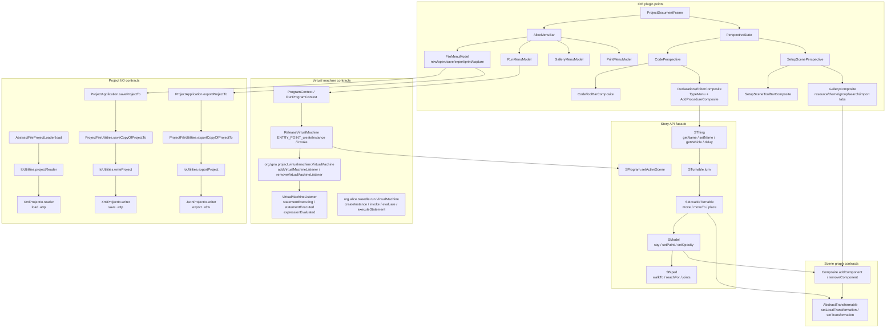

# API Contracts

This layer maps Alice's internal contract surfaces where extension points, VM entry points, scenegraph mutation calls, story facade methods, and project I/O operations meet.

## Contract notes

- The IDE contract surface is menu- and perspective-driven: `ProjectDocumentFrame` wires `AliceMenuBar`, `PerspectiveState`, `CodePerspective`, and `SetupScenePerspective`.
- The VM surface is split across the project VM in `core/ast` (`ReleaseVirtualMachine`, `org.lgna.project.virtualmachine.VirtualMachine`, and `org.lgna.project.virtualmachine.events.VirtualMachineListener`) and the lower-level Tweedle interpreter (`org.alice.tweedle.run.VirtualMachine`).
- The scene graph contract names in current code are `addComponent`/`removeComponent` and `setLocalTransformation`/`setTransformation`, which correspond to the user-facing shorthand “add child/remove child/set transform”.
- The story facade exposes behavior through `SProgram`, `SThing`, `STurnable`, `SMovableTurnable`, `SModel`, and concrete entities such as `SBiped`.
- Project load flows through `AbstractFileProjectLoader`, `IoUtilities.projectReader`, and `XmlProjectIo.reader()`; save (`.a3p`) flows through `ProjectApplication.saveProjectTo`, `ProjectFileUtilities.saveCopyOfProjectTo`, `IoUtilities.writeProject`, and `XmlProjectIo.writer()`; export (`.a3w`) flows through `ProjectApplication.exportProjectTo`, `ProjectFileUtilities.exportCopyOfProjectTo`, `IoUtilities.exportProject`, and `JsonProjectIo.writer()`.

Derived from: `core/ide/src/main/java/org/alice/ide/ProjectDocumentFrame.java`, `core/ide/src/main/java/org/alice/ide/croquet/models/menubar/FileMenuModel.java`, `core/ide/src/main/java/org/alice/stageide/perspectives/CodePerspective.java`, `core/ide/src/main/java/org/alice/stageide/perspectives/SetupScenePerspective.java`, `core/ide/src/main/java/org/alice/stageide/gallerybrowser/GalleryComposite.java`, `core/ide/src/main/java/org/alice/stageide/program/ProgramContext.java`, `core/ast/src/main/java/org/lgna/project/virtualmachine/VirtualMachine.java`, `core/ast/src/main/java/org/lgna/project/virtualmachine/events/VirtualMachineListener.java`, `core/tweedle/src/main/java/org/alice/tweedle/run/VirtualMachine.java`, `core/story-api/src/main/java/org/lgna/story/SProgram.java`, `core/story-api/src/main/java/org/lgna/story/SThing.java`, `core/story-api/src/main/java/org/lgna/story/SMovableTurnable.java`, `core/story-api/src/main/java/org/lgna/story/SModel.java`, `core/story-api/src/main/java/org/lgna/story/SBiped.java`, `core/scenegraph/src/main/java/edu/cmu/cs/dennisc/scenegraph/Composite.java`, `core/scenegraph/src/main/java/edu/cmu/cs/dennisc/scenegraph/AbstractTransformable.java`, `core/ide/src/main/java/org/alice/ide/ProjectApplication.java`, `core/ide/src/main/java/org/alice/ide/ProjectFileUtilities.java`, `core/ide/src/main/java/org/alice/ide/uricontent/AbstractFileProjectLoader.java`, `core/story-api-migration/src/main/java/org/lgna/project/io/IoUtilities.java`, `core/story-api-migration/src/main/java/org/lgna/project/io/XmlProjectIo.java`, and `core/story-api-migration/src/main/java/org/lgna/project/io/JsonProjectIo.java`.

## Mermaid

Source: [`api-contracts.mmd`](./api-contracts.mmd)

## Graphviz DOT

```dot
digraph api_contracts {
  rankdir=LR;
  graph [fontname="Helvetica", labelloc=t, label="Alice internal API contracts"];
  node [shape=box, style="rounded,filled", fillcolor="#F8F9FA", color="#34495E", fontname="Helvetica"];
  edge [color="#5D6D7E", arrowsize=0.8];

  subgraph cluster_ide {
    label="IDE plugin points";
    color="#85C1E9";
    style="rounded";
    frame [label="ProjectDocumentFrame", fillcolor="#D6EAF8"];
    menubar [label="AliceMenuBar", fillcolor="#D6EAF8"];
    filemenu [label="FileMenuModel\nnew/open/save/export/print/capture", fillcolor="#D6EAF8"];
    runmenu [label="RunMenuModel", fillcolor="#D6EAF8"];
    gallerymenu [label="GalleryMenuModel", fillcolor="#D6EAF8"];
    printmenu [label="PrintMenuModel", fillcolor="#D6EAF8"];
    perspectives [label="PerspectiveState", fillcolor="#D6EAF8"];
    codep [label="CodePerspective", fillcolor="#D6EAF8"];
    scenep [label="SetupScenePerspective", fillcolor="#D6EAF8"];
    codetb [label="CodeToolBarComposite", fillcolor="#D6EAF8"];
    scenetb [label="SetupSceneToolBarComposite", fillcolor="#D6EAF8"];
    decls [label="DeclarationsEditorComposite\nTypeMenu + AddProcedureComposite", fillcolor="#D6EAF8"];
    gallery [label="GalleryComposite\nresource/theme/group/search/import tabs", fillcolor="#D6EAF8"];

    frame -> menubar;
    menubar -> filemenu;
    menubar -> runmenu;
    menubar -> gallerymenu;
    menubar -> printmenu;
    frame -> perspectives;
    perspectives -> codep;
    perspectives -> scenep;
    codep -> codetb;
    codep -> decls;
    scenep -> scenetb;
    scenep -> gallery;
  }

  subgraph cluster_vm {
    label="Virtual machine contracts";
    color="#A9DFBF";
    style="rounded";
    runctx [label="ProgramContext / RunProgramContext", fillcolor="#D5F5E3"];
    releasevm [label="ReleaseVirtualMachine\nENTRY_POINT_createInstance / invoke", fillcolor="#D5F5E3"];
    astvm [label="org.lgna.project.virtualmachine.VirtualMachine\naddVirtualMachineListener / removeVirtualMachineListener", fillcolor="#D5F5E3"];
    vmlisten [label="VirtualMachineListener\nstatementExecuting / statementExecuted\nexpressionEvaluated", fillcolor="#D5F5E3"];
    tweedlevm [label="org.alice.tweedle.run.VirtualMachine\ncreateInstance / invoke / evaluate / executeStatement", fillcolor="#D5F5E3"];

    runctx -> releasevm;
    releasevm -> astvm;
    astvm -> vmlisten;
  }

  subgraph cluster_story {
    label="Story API facade";
    color="#F5B7B1";
    style="rounded";
    sprog [label="SProgram.setActiveScene", fillcolor="#FADBD8"];
    sthing [label="SThing\ngetName / setName / getVehicle / delay", fillcolor="#FADBD8"];
    sturn [label="STurnable.turn", fillcolor="#FADBD8"];
    smove [label="SMovableTurnable\nmove / moveTo / place", fillcolor="#FADBD8"];
    smodel [label="SModel\nsay / setPaint / setOpacity", fillcolor="#FADBD8"];
    sbiped [label="SBiped\nwalkTo / reachFor / joints", fillcolor="#FADBD8"];

    sthing -> sturn;
    sturn -> smove;
    smove -> smodel;
    smodel -> sbiped;
  }

  subgraph cluster_scenegraph {
    label="Scene graph contracts";
    color="#F9E79F";
    style="rounded";
    composite [label="Composite.addComponent / removeComponent", fillcolor="#FCF3CF"];
    xform [label="AbstractTransformable\nsetLocalTransformation / setTransformation", fillcolor="#FCF3CF"];

    composite -> xform;
  }

  subgraph cluster_io {
    label="Project I/O contracts";
    color="#D2B4DE";
    style="rounded";
    loader [label="AbstractFileProjectLoader.load", fillcolor="#EBDEF0"];
    readio [label="IoUtilities.projectReader", fillcolor="#EBDEF0"];
    xmlread [label="XmlProjectIo.reader\nload .a3p", fillcolor="#EBDEF0"];
    saveapp [label="ProjectApplication.saveProjectTo", fillcolor="#EBDEF0"];
    savefiles [label="ProjectFileUtilities.saveCopyOfProjectTo", fillcolor="#EBDEF0"];
    saveio [label="IoUtilities.writeProject", fillcolor="#EBDEF0"];
    xmlwrite [label="XmlProjectIo.writer\nsave .a3p", fillcolor="#EBDEF0"];
    exportapp [label="ProjectApplication.exportProjectTo", fillcolor="#EBDEF0"];
    exportfiles [label="ProjectFileUtilities.exportCopyOfProjectTo", fillcolor="#EBDEF0"];
    exportio [label="IoUtilities.exportProject", fillcolor="#EBDEF0"];
    jsonwrite [label="JsonProjectIo.writer\nexport .a3w", fillcolor="#EBDEF0"];

    loader -> readio;
    readio -> xmlread;
    saveapp -> savefiles;
    savefiles -> saveio;
    saveio -> xmlwrite;
    exportapp -> exportfiles;
    exportfiles -> exportio;
    exportio -> jsonwrite;
  }

  filemenu -> saveapp;
  filemenu -> exportapp;
  runmenu -> runctx;
  decls -> sthing;
  gallery -> composite;
  releasevm -> sprog;
  smove -> xform;
  smodel -> composite;
}
```

Source: [`api-contracts.dot`](./api-contracts.dot)
