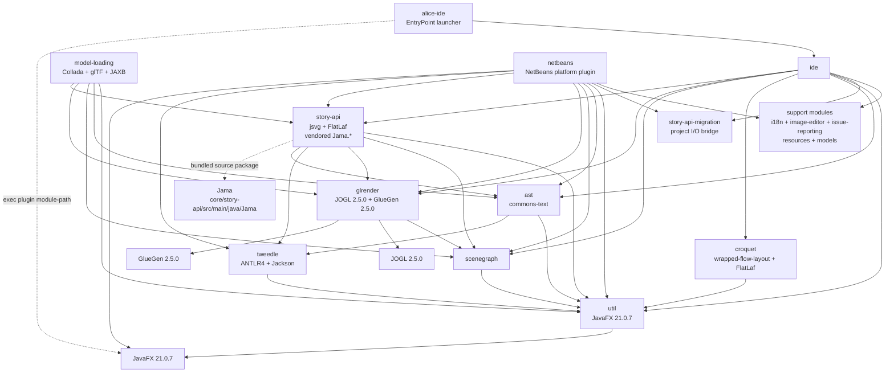
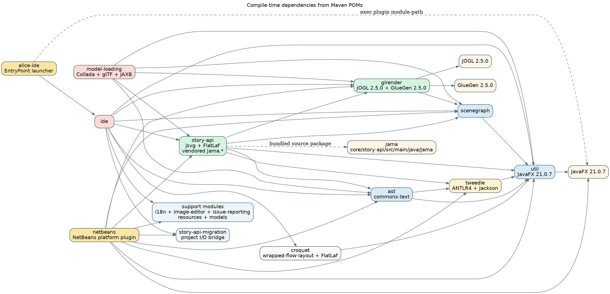

# Compile-time Dependencies

This layer maps Maven POM dependencies between the main Alice modules and the key third-party technologies they pull in.
The graph follows declared dependencies first, with one extra structural note for `Jama`, which is vendored inside `core/story-api` rather than declared as a Maven artifact.

## Dependency notes

- `util` is the base library for JavaFX-enabled desktop support.
- `story-api` is the main convergence point: it depends on `ast`, `tweedle`, `scenegraph`, `glrender`, and `util`, while also carrying the bundled `Jama` math package.
- `glrender` is the JOGL/GlueGen bridge; `alice-ide` and `netbeans` reach JavaFX through launcher/plugin wiring rather than only through direct Java code imports.
- `story-api-migration` is shown as its own direct edge because both `ide` and `netbeans` declare it explicitly for project I/O, while the remaining support modules stay grouped as `i18n`, `image-editor`, `issue-reporting`, `resources`, and `models`.

## Mermaid

Source: [`compile-deps.mmd`](./compile-deps.mmd)

## Graphviz DOT

Source: [`compile-deps.dot`](./compile-deps.dot)
