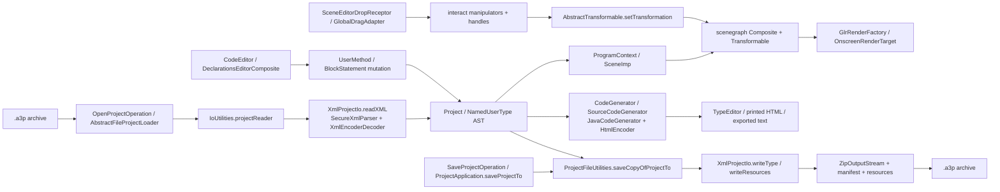

# Data Flow

This layer follows the main behavioral data paths through Alice's desktop authoring loop.

## Flow notes

- `.a3p` project load starts with `AbstractFileProjectLoader`, then `IoUtilities.projectReader`, and finally `XmlProjectIo.readXML` + `XmlEncoderDecoder` to reconstruct the `Project`/`NamedUserType` AST.
- Rendering is fed from the loaded AST through `ProgramContext`, `SceneImp`, the scenegraph, and `GlrRenderFactory`/`OnscreenRenderTarget`.
- Code editing mutates AST structures directly in `CodeEditor`; generated source is a secondary surface used by code generators and print/export paths rather than the primary block editor.
- Dragging in the scene editor flows through `SceneEditorDropReceptor`, `GlobalDragAdapter`, and the interaction/manipulator stack before scenegraph transforms are updated.
- Save/export turns the current AST back into XML + resources + manifest entries inside a ZIP-backed `.a3p` archive.

Derived from: `core/ide/src/main/java/org/alice/ide/uricontent/AbstractFileProjectLoader.java`, `core/story-api-migration/src/main/java/org/lgna/project/io/IoUtilities.java`, `core/story-api-migration/src/main/java/org/lgna/project/io/XmlProjectIo.java`, `core/ide/src/main/java/org/alice/stageide/program/ProgramContext.java`, `core/story-api/src/main/java/org/lgna/story/implementation/SceneImp.java`, `core/ide/src/main/java/org/alice/ide/codeeditor/CodeEditor.java`, `core/ast/src/main/java/org/lgna/project/code/CodeGenerator.java`, `core/ast/src/main/java/org/lgna/project/ast/SourceCodeGenerator.java`, `core/ast/src/main/java/org/lgna/project/ast/JavaCodeGenerator.java`, `core/ide/src/main/java/org/alice/ide/declarationseditor/components/TypeEditor.java`, `core/ide/src/main/java/org/alice/stageide/sceneeditor/SceneEditorDropReceptor.java`, `core/ide/src/main/java/org/alice/stageide/sceneeditor/interact/GlobalDragAdapter.java`, `core/scenegraph/src/main/java/edu/cmu/cs/dennisc/scenegraph/AbstractTransformable.java`, `core/ide/src/main/java/org/alice/ide/ProjectApplication.java`, and `core/ide/src/main/java/org/alice/ide/ProjectFileUtilities.java`.

## Mermaid

Source: [`data-flow.mmd`](./data-flow.mmd)

## Graphviz DOT

```dot
digraph data_flow {
  rankdir=LR;
  graph [fontname="Helvetica", labelloc=t, label="Alice behavioral data flow"];
  node [shape=box, style="rounded,filled", fillcolor="#F8F9FA", color="#34495E", fontname="Helvetica"];
  edge [color="#5D6D7E", arrowsize=0.8];

  loadA3p [label=".a3p archive", fillcolor="#F9E79F"];
  loadReq [label="OpenProjectOperation /\nAbstractFileProjectLoader", fillcolor="#D6EAF8"];
  readIo [label="IoUtilities.projectReader", fillcolor="#D6EAF8"];
  readXml [label="XmlProjectIo.readXML\nSecureXmlParser + XmlEncoderDecoder", fillcolor="#D6EAF8"];
  ast [label="Project / NamedUserType AST", fillcolor="#D5F5E3"];
  sceneboot [label="ProgramContext / SceneImp", fillcolor="#FADBD8"];
  scenegraph [label="scenegraph Composite + Transformable", fillcolor="#FCF3CF"];
  render [label="GlrRenderFactory / OnscreenRenderTarget", fillcolor="#FCF3CF"];

  editUi [label="CodeEditor /\nDeclarationsEditorComposite", fillcolor="#EBDEF0"];
  astMut [label="UserMethod / BlockStatement mutation", fillcolor="#EBDEF0"];
  generated [label="CodeGenerator / SourceCodeGenerator\nJavaCodeGenerator + HtmlEncoder", fillcolor="#EBDEF0"];
  display [label="TypeEditor / printed HTML / exported text", fillcolor="#EBDEF0"];

  dragUi [label="SceneEditorDropReceptor /\nGlobalDragAdapter", fillcolor="#F5B7B1"];
  interact [label="interact manipulators + handles", fillcolor="#F5B7B1"];
  transform [label="AbstractTransformable.setTransformation", fillcolor="#F5B7B1"];

  saveReq [label="SaveProjectOperation /\nProjectApplication.saveProjectTo", fillcolor="#D2B4DE"];
  snapshot [label="ProjectFileUtilities.saveCopyOfProjectTo", fillcolor="#D2B4DE"];
  writeXml [label="XmlProjectIo.writeType / writeResources", fillcolor="#D2B4DE"];
  zip [label="ZipOutputStream + manifest + resources", fillcolor="#D2B4DE"];
  outA3p [label=".a3p archive", fillcolor="#D2B4DE"];

  loadA3p -> loadReq;
  loadReq -> readIo;
  readIo -> readXml;
  readXml -> ast;
  ast -> sceneboot;
  sceneboot -> scenegraph;
  scenegraph -> render;

  editUi -> astMut;
  astMut -> ast;
  ast -> generated;
  generated -> display;

  dragUi -> interact;
  interact -> transform;
  transform -> scenegraph;

  saveReq -> snapshot;
  ast -> snapshot;
  snapshot -> writeXml;
  writeXml -> zip;
  zip -> outA3p;
}
```

Source: [`data-flow.dot`](./data-flow.dot)
