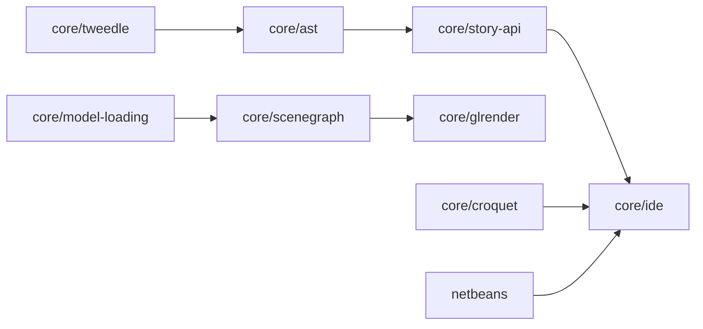

# Module Dependencies

This atlas page highlights the main Maven module relationships that shape the Alice desktop stack.

```mermaid
flowchart LR
    tweedle["core/tweedle"] --> ast["core/ast"]
    ast --> story["core/story-api"]
    story --> ide["core/ide"]

    scenegraph["core/scenegraph"] --> glrender["core/glrender"]
    modelLoading["core/model-loading"] --> scenegraph

    croquet["core/croquet"] --> ide
    netbeans["netbeans"] --> ide
```
