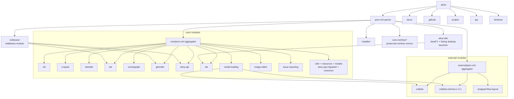
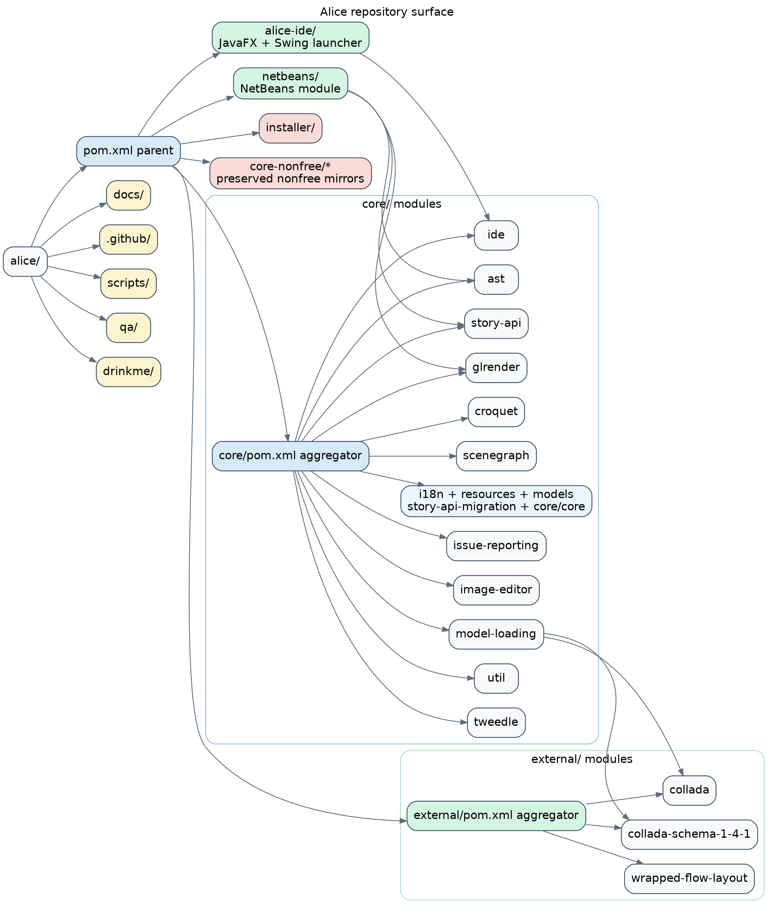

# Repository Surface

This layer maps the parent Maven structure and the operational top-level directories around it.
The diagram is derived from the root `pom.xml`, the first `find . -name "pom.xml"` scan, and the `core/*/` directory sweep requested in the task.

## Structural notes

- `pom.xml` is the parent aggregator for `core/`, `external/`, `alice-ide/`, `netbeans/`, `installer/`, and preserved `core-nonfree/*` modules.
- `core/` splits into foundations (`util`, `croquet`, `tweedle`, `ast`) and runtime/UI modules (`scenegraph`, `glrender`, `story-api`, `ide`, `model-loading`).
- `drinkme/`, `qa/`, `scripts/`, and `.github/` are outside the production module graph but materially affect investigation, validation, and automation.

## Mermaid

Source: [`repo-surface.mmd`](./repo-surface.mmd)

## Graphviz DOT

Source: [`repo-surface.dot`](./repo-surface.dot)
