# Runtime Topology

This layer follows the desktop launch path starting at `alice-ide` and then separates the UI composition path from the world-execution/rendering path.
The code shows two distinct execution mechanisms: the live editor/run windows use `org.lgna.project.virtualmachine.ReleaseVirtualMachine`, while `core/tweedle` contributes manifest codecs and a standalone VM module that is not referenced from the desktop launch path.

## Runtime notes

- `EntryPoint.main` bootstraps Swing/JavaFX, initializes JOGL native loading, and then constructs `StageIDE`.
- `ProjectDocumentFrame` fans into the two main perspectives: setup-scene (`StorytellingSceneEditor` + `GalleryComposite`) and code (`DeclarationsEditorComposite` + `CodeEditor`).
- Both scene preview and Run window execution converge on `ProgramImp`, `GlrRenderFactory`, `OnscreenRenderTarget`, and the JOGL/OpenGL display loop.

## Mermaid

```mermaid
flowchart LR
  entry["alice-ide<br/>EntryPoint.main"] --> loader["RendererNativeLibraryLoader<br/>initializeIfNecessary()"]
  loader --> stageide["StageIDE<br/>extends IDE"]
  stageide --> frame["ProjectDocumentFrame<br/>PerspectiveState"]

  frame --> setup["SetupScenePerspective"]
  frame --> code["CodePerspective"]

  setup --> setupcomp["SetupScenePerspectiveComposite"]
  setupcomp --> scene["StorytellingSceneEditor"]
  setupcomp --> gallery["GalleryComposite"]
  code --> codecomp["CodePerspectiveComposite"]
  codecomp --> decls["DeclarationsEditorComposite"]
  decls --> codeeditor["CodeEditor"]

  scene --> scenevm["ReleaseVirtualMachine<br/>scene editor VM"]
  scene --> lifecycle["SceneEditorLifecycleManager<br/>performGeneratedSetUp"]
  lifecycle --> scenevm

  codeeditor --> run["RunComposite"]
  run --> runctx["RunProgramContext"]
  runctx --> runvm["ReleaseVirtualMachine<br/>program run VM"]
  runvm --> program["ProgramImp / SProgram"]

  program --> render["GlrRenderFactory"]
  render --> target["OnscreenRenderTarget"]
  target --> opengl["JOGL / OpenGL pipeline"]

  gallery --> scene
  tweedle["core/tweedle<br/>ManifestEncoderDecoder<br/>standalone Tweedle VM module"] -.project/model archive metadata.-> stageide
  tweedle -.not used by desktop launch path for world execution.-> runvm
```

Source: [`runtime-topology.mmd`](./runtime-topology.mmd)

## Graphviz DOT

```dot
digraph runtime_topology {
  rankdir=LR;
  graph [fontname="Helvetica", labelloc=t, label="Runtime topology: Alice desktop launch path"];
  node [shape=box, style="rounded,filled", fillcolor="#F8F9FA", color="#34495E", fontname="Helvetica"];
  edge [color="#5D6D7E", arrowsize=0.8];

  subgraph cluster_launcher {
    label="Launcher";
    color="#85C1E9";
    style="rounded";
    entry [label="alice-ide
EntryPoint.main", fillcolor="#D6EAF8"];
    loader [label="RendererNativeLibraryLoader
initializeIfNecessary()", fillcolor="#D6EAF8"];
    stageide [label="StageIDE
extends IDE", fillcolor="#D6EAF8"];
    frame [label="ProjectDocumentFrame
PerspectiveState", fillcolor="#D6EAF8"];

    entry -> loader;
    loader -> stageide;
    stageide -> frame;
  }

  subgraph cluster_ui {
    label="UI perspectives";
    color="#A9DFBF";
    style="rounded";
    setup [label="SetupScenePerspective", fillcolor="#D5F5E3"];
    setupcomp [label="SetupScenePerspectiveComposite", fillcolor="#D5F5E3"];
    scene [label="StorytellingSceneEditor", fillcolor="#D5F5E3"];
    gallery [label="GalleryComposite", fillcolor="#D5F5E3"];
    code [label="CodePerspective", fillcolor="#D5F5E3"];
    codecomp [label="CodePerspectiveComposite", fillcolor="#D5F5E3"];
    decls [label="DeclarationsEditorComposite", fillcolor="#D5F5E3"];
    codeeditor [label="CodeEditor", fillcolor="#D5F5E3"];

    frame -> setup;
    frame -> code;
    setup -> setupcomp;
    setupcomp -> scene;
    setupcomp -> gallery;
    code -> codecomp;
    codecomp -> decls;
    decls -> codeeditor;
    gallery -> scene;
  }

  subgraph cluster_execution {
    label="Execution VMs";
    color="#F5B7B1";
    style="rounded";
    scenevm [label="ReleaseVirtualMachine
scene editor VM", fillcolor="#FADBD8"];
    lifecycle [label="SceneEditorLifecycleManager
performGeneratedSetUp", fillcolor="#FADBD8"];
    run [label="RunComposite", fillcolor="#FADBD8"];
    runctx [label="RunProgramContext", fillcolor="#FADBD8"];
    runvm [label="ReleaseVirtualMachine
program run VM", fillcolor="#FADBD8"];
    program [label="ProgramImp / SProgram", fillcolor="#FADBD8"];

    scene -> scenevm;
    scene -> lifecycle;
    lifecycle -> scenevm;
    codeeditor -> run;
    run -> runctx;
    runctx -> runvm;
    runvm -> program;
  }

  subgraph cluster_rendering {
    label="Rendering";
    color="#F9E79F";
    style="rounded";
    render [label="GlrRenderFactory", fillcolor="#FCF3CF"];
    target [label="OnscreenRenderTarget", fillcolor="#FCF3CF"];
    opengl [label="JOGL / OpenGL pipeline", fillcolor="#FCF3CF"];

    program -> render;
    render -> target;
    target -> opengl;
  }

  tweedle [label="core/tweedle
ManifestEncoderDecoder
standalone Tweedle VM module", fillcolor="#FEF5E7"];
  tweedle -> stageide [style=dashed, label="project/model archive metadata"];
  tweedle -> runvm [style=dashed, label="not used by desktop launch path"];
}
```

Source: [`runtime-topology.dot`](./runtime-topology.dot)
