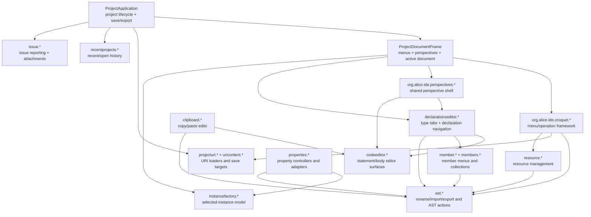
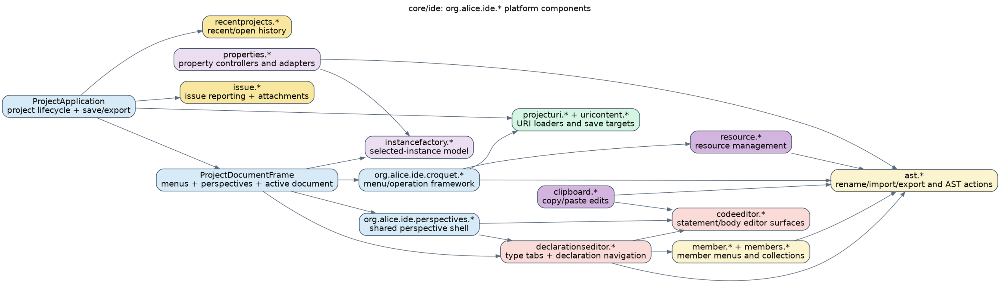
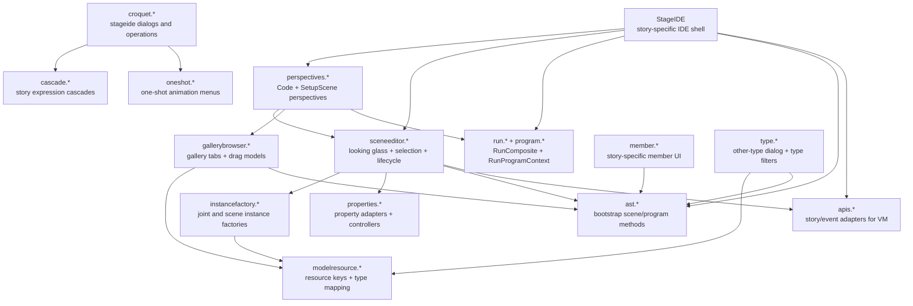
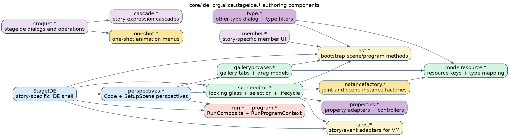
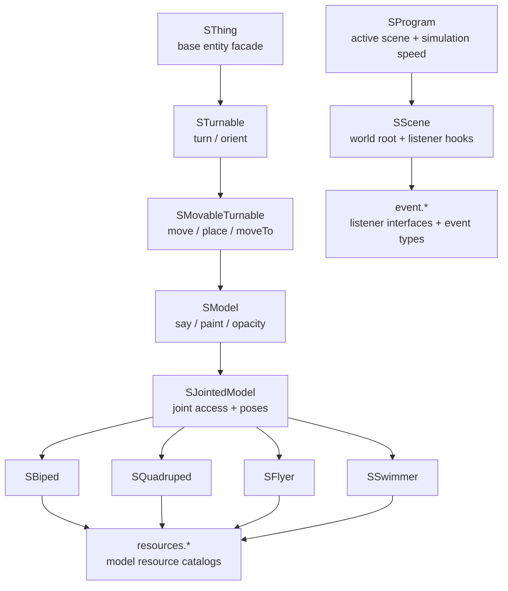
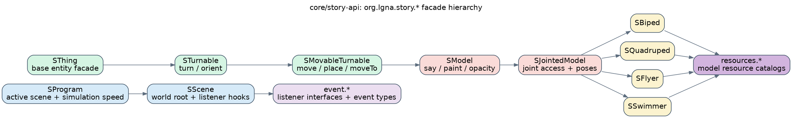
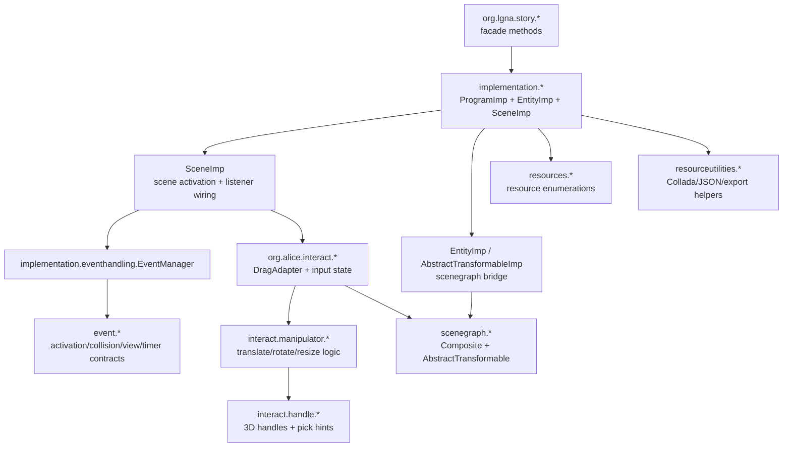
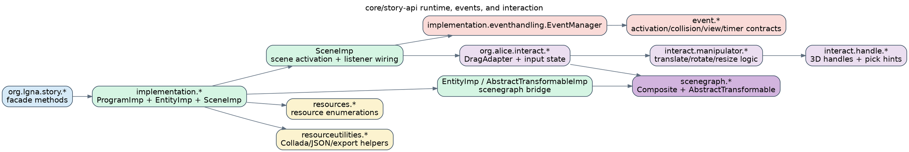

# Service Components

This layer splits the two largest behavioral modules into readable sub-diagrams instead of forcing one dense graph.

## Split rationale

- `core/ide` spans both `org.alice.ide.*` platform code and `org.alice.stageide.*` story-authoring code, so it is split into **ide-platform** and **stageide-authoring**.
- `core/story-api` mixes the user-facing facade hierarchy with runtime/event/interaction internals, so it is split into **story-api-facade** and **story-api-runtime**.
- Each sub-diagram stays within a readable density envelope while preserving the dominant package couplings seen in the codebase.

Derived from package sweeps and representative classes in: `core/ide/src/main/java/org/alice/ide/**`, `core/ide/src/main/java/org/alice/stageide/**`, `core/story-api/src/main/java/org/lgna/story/**`, and `core/story-api/src/main/java/org/alice/interact/**`.

## core/ide — ide platform

The platform side owns project lifecycle, menu/croquet wiring, declaration tabs, AST actions, and save/load plumbing.

### Mermaid

Source: [`ide-platform.mmd`](./ide-platform.mmd)

### Graphviz DOT

Source: [`ide-platform.dot`](./ide-platform.dot)

## core/ide — stageide authoring

The story-authoring side layers scene editing, gallery drag/drop, story-specific AST bootstrap code, run-window execution, and stage-specific croquet flows on top of the generic IDE shell.

### Mermaid

Source: [`stageide-authoring.mmd`](./stageide-authoring.mmd)

### Graphviz DOT

Source: [`stageide-authoring.dot`](./stageide-authoring.dot)

## core/story-api — facade hierarchy

This view stays on the public `org.lgna.story.*` hierarchy that student-authored code targets.

### Mermaid

Source: [`story-api-facade.mmd`](./story-api-facade.mmd)

### Graphviz DOT

Source: [`story-api-facade.dot`](./story-api-facade.dot)

## core/story-api — runtime, events, and interaction

This view follows the runtime bridge from the facade into implementations, event dispatch, and the interaction/manipulator stack that lives in the same module.

### Mermaid

Source: [`story-api-runtime.mmd`](./story-api-runtime.mmd)

### Graphviz DOT

Source: [`story-api-runtime.dot`](./story-api-runtime.dot)
