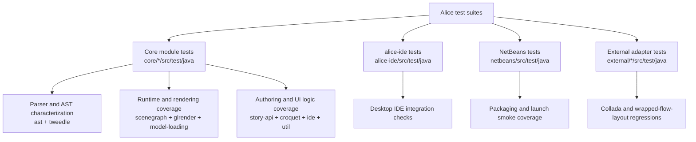

# Test Architecture

The Alice test suite is organized by Maven module, with desktop and packaging checks layered on top of the reusable core modules.

```mermaid
flowchart TD
    suite["Alice test suites"] --> core["Core module tests<br/>core/*/src/test/java"]
    suite --> app["alice-ide tests<br/>alice-ide/src/test/java"]
    suite --> netbeans["NetBeans tests<br/>netbeans/src/test/java"]
    suite --> external["External adapter tests<br/>external/*/src/test/java"]

    core --> parsing["Parser and AST characterization<br/>ast + tweedle"]
    core --> runtime["Runtime and rendering coverage<br/>scenegraph + glrender + model-loading"]
    core --> authoring["Authoring and UI logic coverage<br/>story-api + croquet + ide + util"]

    app --> desktop["Desktop IDE integration checks"]
    netbeans --> packaging["Packaging and launch smoke coverage"]
    external --> adapters["Collada and wrapped-flow-layout regressions"]
```
