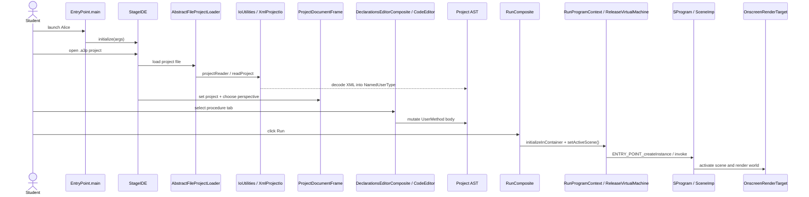
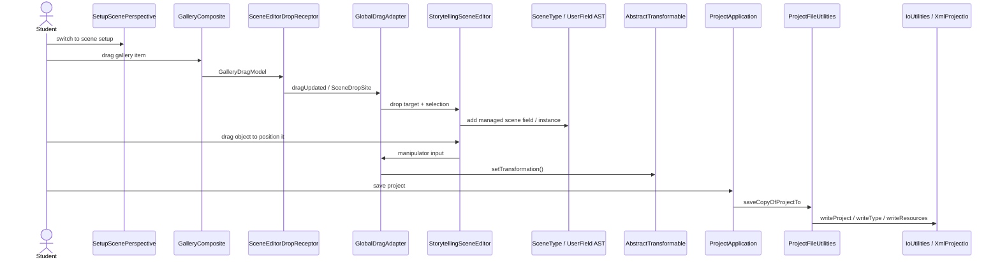
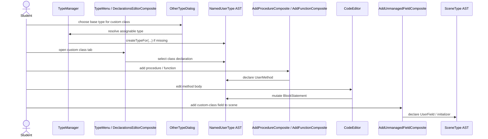
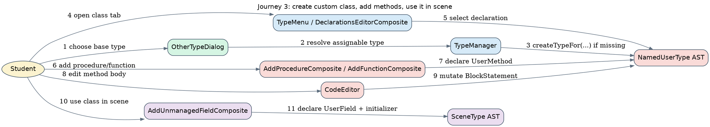
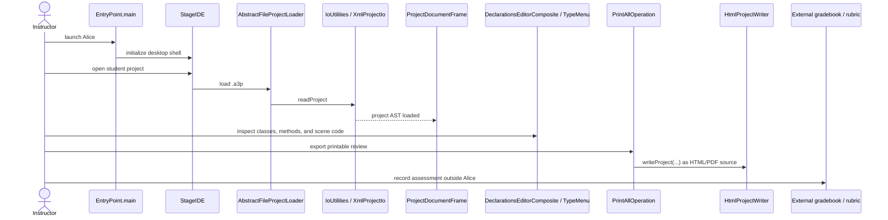
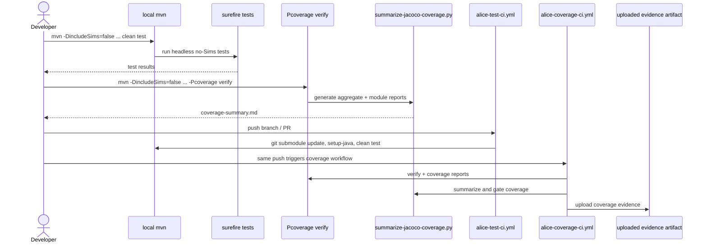
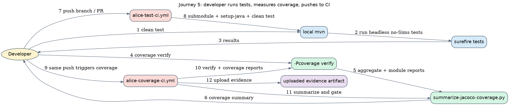

# User Journeys

This layer traces five high-value paths through Alice's behavioral stack. The first four stay inside the IDE until they hit an explicit system boundary; the fifth follows the repository's documented local/CI validation path.

## Journey notes

- Journeys 1 and 2 stay inside the desktop authoring loop: load/edit/run and add/position/save.
- Journey 3 uses `TypeManager`, `OtherTypeDialog`, and declaration editors to show how custom types and methods become scene-usable AST declarations.
- Journey 4 stops at the review/export boundary because grading itself happens outside Alice; the codebase exposes review surfaces (`DeclarationsEditorComposite`, `PrintAllOperation`, `HtmlProjectWriter`) rather than an internal grading subsystem.
- Journey 5 is grounded in the repository's documented headless Maven and coverage workflows plus the two GitHub Actions lanes.

Derived from: `alice-ide/src/main/java/org/alice/stageide/EntryPoint.java`, `core/ide/src/main/java/org/alice/ide/IDE.java`, `core/ide/src/main/java/org/alice/ide/uricontent/AbstractFileProjectLoader.java`, `core/story-api-migration/src/main/java/org/lgna/project/io/IoUtilities.java`, `core/ide/src/main/java/org/alice/ide/declarationseditor/TypeMenu.java`, `core/ide/src/main/java/org/alice/ide/codeeditor/CodeEditor.java`, `core/ide/src/main/java/org/alice/stageide/run/RunComposite.java`, `core/ide/src/main/java/org/alice/stageide/program/ProgramContext.java`, `core/ide/src/main/java/org/alice/stageide/gallerybrowser/GalleryComposite.java`, `core/ide/src/main/java/org/alice/stageide/sceneeditor/SceneEditorDropReceptor.java`, `core/ide/src/main/java/org/alice/stageide/sceneeditor/interact/GlobalDragAdapter.java`, `core/ide/src/main/java/org/alice/ide/ProjectApplication.java`, `core/ide/src/main/java/org/alice/ide/ProjectFileUtilities.java`, `core/ide/src/main/java/org/alice/ide/typemanager/TypeManager.java`, `core/ide/src/main/java/org/alice/stageide/type/croquet/OtherTypeDialog.java`, `core/ide/src/main/java/org/alice/ide/ast/declaration/AddProcedureComposite.java`, `core/ide/src/main/java/org/alice/ide/ast/declaration/AddFunctionComposite.java`, `core/ide/src/main/java/org/alice/ide/ast/declaration/AddUnmanagedFieldComposite.java`, `core/ide/src/main/java/org/alice/ide/croquet/models/print/PrintAllOperation.java`, `core/ide/src/main/java/org/alice/ide/croquet/models/html/HtmlProjectWriter.java`, `README.md`, `.github/workflows/alice-test-ci.yml`, and `.github/workflows/alice-coverage-ci.yml`.

## 1. Student opens Alice, loads project, edits procedure, runs world

### Mermaid

Source: [`journey-1-open-edit-run.mmd`](./journey-1-open-edit-run.mmd)

### Graphviz DOT

```dot
digraph journey_1_open_edit_run {
  rankdir=LR;
  graph [fontname="Helvetica", labelloc=t, label="Journey 1: open project, edit procedure, run world"];
  node [shape=box, style="rounded,filled", fillcolor="#F8F9FA", color="#34495E", fontname="Helvetica"];
  edge [color="#5D6D7E", arrowsize=0.8];

  Student [shape=oval, fillcolor="#FCF3CF"];
  EntryPoint [label="EntryPoint.main", fillcolor="#D6EAF8"];
  IDE [label="StageIDE", fillcolor="#D6EAF8"];
  Loader [label="AbstractFileProjectLoader", fillcolor="#D5F5E3"];
  IO [label="IoUtilities / XmlProjectIo", fillcolor="#D5F5E3"];
  Frame [label="ProjectDocumentFrame", fillcolor="#D6EAF8"];
  Editor [label="DeclarationsEditorComposite / CodeEditor", fillcolor="#FADBD8"];
  AST [label="Project AST", fillcolor="#FADBD8"];
  Run [label="RunComposite", fillcolor="#EBDEF0"];
  VM [label="RunProgramContext / ReleaseVirtualMachine", fillcolor="#EBDEF0"];
  World [label="SProgram / SceneImp", fillcolor="#D2B4DE"];
  Render [label="OnscreenRenderTarget", fillcolor="#D2B4DE"];

  Student -> EntryPoint [label="1 launch Alice"];
  EntryPoint -> IDE [label="2 initialize(args)"];
  Student -> IDE [label="3 open .a3p"];
  IDE -> Loader [label="4 load project"];
  Loader -> IO [label="5 projectReader/readProject"];
  IO -> AST [label="6 decode XML -> NamedUserType"];
  IDE -> Frame [label="7 set project + perspective"];
  Student -> Editor [label="8 select procedure"];
  Editor -> AST [label="9 mutate method body"];
  Student -> Run [label="10 click Run"];
  Run -> VM [label="11 init + setActiveScene()"];
  VM -> World [label="12 create/invoke program"];
  World -> Render [label="13 activate + render"];
}
```

Source: [`journey-1-open-edit-run.dot`](./journey-1-open-edit-run.dot)

## 2. Student adds entity to scene, positions it, saves

### Mermaid

Source: [`journey-2-add-position-save.mmd`](./journey-2-add-position-save.mmd)

### Graphviz DOT

```dot
digraph journey_2_add_position_save {
  rankdir=LR;
  graph [fontname="Helvetica", labelloc=t, label="Journey 2: add entity, position it, save project"];
  node [shape=box, style="rounded,filled", fillcolor="#F8F9FA", color="#34495E", fontname="Helvetica"];
  edge [color="#5D6D7E", arrowsize=0.8];

  Student [shape=oval, fillcolor="#FCF3CF"];
  Setup [label="SetupScenePerspective", fillcolor="#D6EAF8"];
  Gallery [label="GalleryComposite", fillcolor="#D6EAF8"];
  Drop [label="SceneEditorDropReceptor", fillcolor="#D5F5E3"];
  Drag [label="GlobalDragAdapter", fillcolor="#D5F5E3"];
  Scene [label="StorytellingSceneEditor", fillcolor="#FADBD8"];
  AST [label="SceneType / UserField AST", fillcolor="#FADBD8"];
  Xform [label="AbstractTransformable", fillcolor="#EBDEF0"];
  Save [label="ProjectApplication", fillcolor="#D2B4DE"];
  Files [label="ProjectFileUtilities", fillcolor="#D2B4DE"];
  IO [label="IoUtilities / XmlProjectIo", fillcolor="#D2B4DE"];

  Student -> Setup [label="1 switch to scene setup"];
  Student -> Gallery [label="2 drag gallery item"];
  Gallery -> Drop [label="3 GalleryDragModel"];
  Drop -> Drag [label="4 SceneDropSite"];
  Drag -> Scene [label="5 target + selection"];
  Scene -> AST [label="6 add scene field / instance"];
  Student -> Scene [label="7 drag to position"];
  Scene -> Drag [label="8 manipulator input"];
  Drag -> Xform [label="9 setTransformation()"];
  Student -> Save [label="10 save project"];
  Save -> Files [label="11 saveCopyOfProjectTo"];
  Files -> IO [label="12 write XML/resources"];
}
```

Source: [`journey-2-add-position-save.dot`](./journey-2-add-position-save.dot)

## 3. Student creates custom class, adds methods, uses it in scene

### Mermaid

Source: [`journey-3-custom-class.mmd`](./journey-3-custom-class.mmd)

### Graphviz DOT

Source: [`journey-3-custom-class.dot`](./journey-3-custom-class.dot)

## 4. Instructor opens student project, reviews code, grades

### Mermaid

Source: [`journey-4-instructor-review-grade.mmd`](./journey-4-instructor-review-grade.mmd)

### Graphviz DOT

```dot
digraph journey_4_instructor_review_grade {
  rankdir=LR;
  graph [fontname="Helvetica", labelloc=t, label="Journey 4: instructor opens project, reviews code, grades"];
  node [shape=box, style="rounded,filled", fillcolor="#F8F9FA", color="#34495E", fontname="Helvetica"];
  edge [color="#5D6D7E", arrowsize=0.8];

  Instructor [shape=oval, fillcolor="#FCF3CF"];
  EntryPoint [label="EntryPoint.main", fillcolor="#D6EAF8"];
  IDE [label="StageIDE", fillcolor="#D6EAF8"];
  Loader [label="AbstractFileProjectLoader", fillcolor="#D5F5E3"];
  IO [label="IoUtilities / XmlProjectIo", fillcolor="#D5F5E3"];
  Frame [label="ProjectDocumentFrame", fillcolor="#FADBD8"];
  Review [label="DeclarationsEditorComposite / TypeMenu", fillcolor="#FADBD8"];
  Print [label="PrintAllOperation", fillcolor="#EBDEF0"];
  Html [label="HtmlProjectWriter", fillcolor="#EBDEF0"];
  Gradebook [label="External gradebook / rubric", fillcolor="#D2B4DE"];

  Instructor -> EntryPoint [label="1 launch Alice"];
  EntryPoint -> IDE [label="2 initialize shell"];
  Instructor -> IDE [label="3 open student project"];
  IDE -> Loader [label="4 load .a3p"];
  Loader -> IO [label="5 readProject"];
  IO -> Frame [label="6 project AST loaded"];
  Instructor -> Review [label="7 inspect code"];
  Instructor -> Print [label="8 export printable review"];
  Print -> Html [label="9 writeProject(...) HTML"];
  Instructor -> Gradebook [label="10 record grade outside Alice"];
}
```

Source: [`journey-4-instructor-review-grade.dot`](./journey-4-instructor-review-grade.dot)

## 5. Developer runs tests, measures coverage, pushes to CI

### Mermaid

Source: [`journey-5-dev-test-coverage-ci.mmd`](./journey-5-dev-test-coverage-ci.mmd)

### Graphviz DOT

Source: [`journey-5-dev-test-coverage-ci.dot`](./journey-5-dev-test-coverage-ci.dot)
